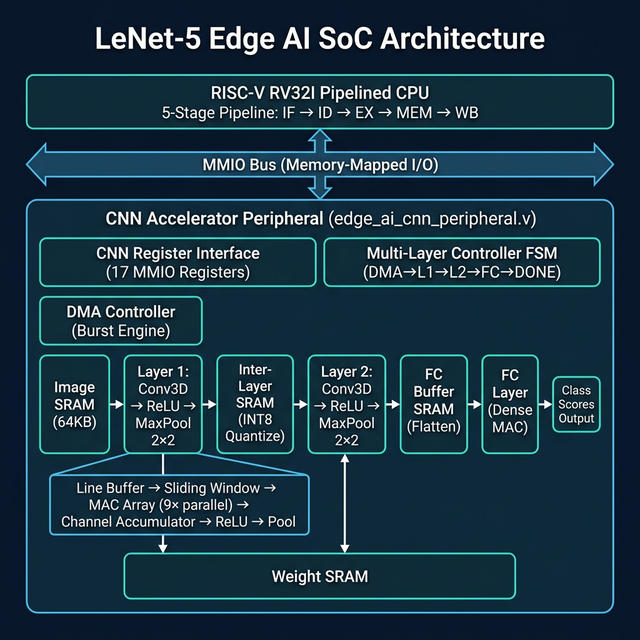
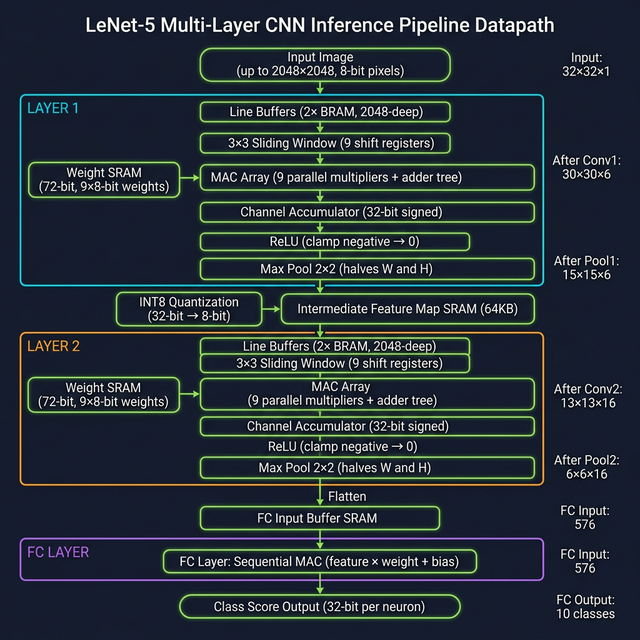
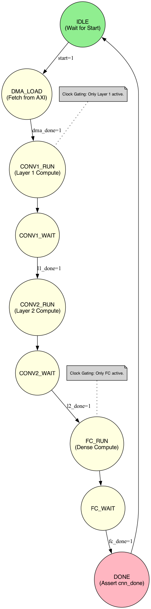
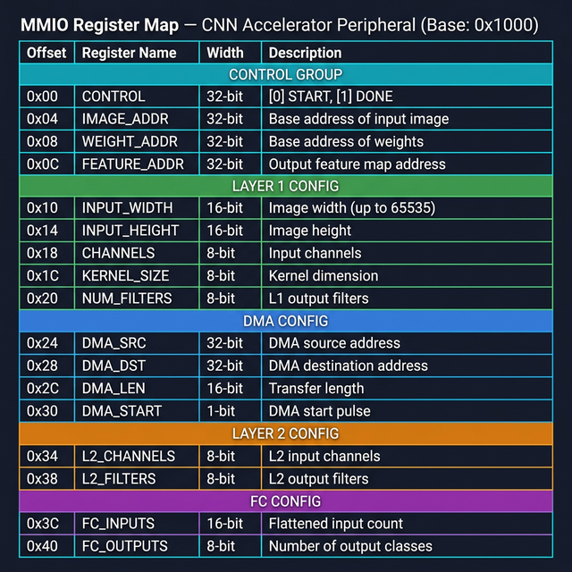

# 🚀 RISC-V RV32I Processor & Custom Edge AI CNN Accelerator

A complete **hardware/verification** project combining a custom **RISC-V RV32I 5-stage pipelined processor** with a memory-mapped **CNN hardware accelerator peripheral**. The goal is to offload convolution-heavy workloads from the CPU into a dedicated datapath built from line buffers, a sliding window generator, and a pipelined MAC array.

> [!IMPORTANT]
> **OpenLane collateral included**: `openlane/system_top/` contains an OpenLane config for `system_top` (100 MHz target clock, DFFRAM enabled, SDC constraints included).

---

## 📖 Project Overview

This repository provides a full-stack hardware/software co-design of an AI-enabled microprocessor. Instead of executing neural network math sequentially on a standard CPU, this system offloads the intense computations of a **LeNet-5 CNN** to a custom-designed **Hardware Accelerator**, achieving massive parallel throughput via a MAC multiplier array and streaming line buffers.

### ⚡ Technical Highlights
- **CNN inference datapath**: `Conv → (BN) → (Skip Add) → Activation → Pool` (×2) → `FC` → score readback.
- **Industrial bus architecture**: **AXI4-Lite Slave** (control/MMIO) + **AXI4 Master** (DMA/data movement) exposed at the top (`rtl/system_top.v`).
- **PPA Optimization**: Implements **Operand Isolation**, **Clock Gating**, and **Deep Pipelining** for energy efficiency and high clock rates.
- **Quantized datapath**: INT8 pixels/weights/features with wider accumulation internally.
- **Burst DMA Engine**: High-bandwidth data movement between external memory and localized SRAM.
- **High-Resolution Support**: Processes feature maps up to **2048×2048 pixels**.

---

## 📐 System Architecture

┌──────────────────────────────────────┐
│          system_top.v                │
│  ┌────────────────────────────────┐  │
│  │      riscv_core_top.v         │  │
│  │  5-Stage Pipeline             │  │
│  │  IF → ID → EX → MEM → WB     │  │
│  └──────────────┬────────────────┘  │
│                 │ AXI4-Lite / MMIO   │
│                 │ (addr[7:0] decode) │
│  ┌──────────────▼────────────────┐  │
│  │  edge_ai_cnn_peripheral.v     │  │
│  │                               │  │
│  │  ┌─────────────────────────┐  │  │
│  │  │   cnn_register_interface│  │  │
│  │  └────────────┬────────────┘  │  │
│  │  ┌────────────▼────────────┐  │  │
│  │  │   cnn_controller (FSM)  │  │  │
│  │  │  DMA→L1→L2→FC→DONE     │  │  │
│  │  └────────────┬────────────┘  │  │
│  │               │               │  │
│  │  ┌────────────▼────────────┐  │  │
│  │  │  DMA Controller         │  │  │
│  │  └────────────┬────────────┘  │  │
│  │               │               │  │
│  │  ┌────────────▼────────────┐  │  │
│  │  │ Layer 1 Pipeline        │  │  │
│  │  │ Conv3D → ReLU → Pool2x2│  │  │
│  │  └────────────┬────────────┘  │  │
│  │          INT8 Quantize        │  │
│  │  ┌────────────▼────────────┐  │  │
│  │  │ Layer 2 Pipeline        │  │  │
│  │  │ Conv3D → ReLU → Pool2x2│  │  │
│  │  └────────────┬────────────┘  │  │
│  │          Flatten              │  │
│  │  ┌────────────▼────────────┐  │  │
│  │  │ FC Layer (Dense)        │  │  │
│  │  │ MAC → Class Scores      │  │  │
│  │  └─────────────────────────┘  │  │
│  └────────────────────────────────┘  │
└──────────────────────────────────────┘
```



> The original single-layer system flowchart is retained for reference: [system_flowchart.png](diagrams/system_flowchart.png)

### 2. LeNet-5 Inference Pipeline

The accelerator implements a complete neural network inference datapath:

```text
Input Image (up to 2048×2048)
      │
      ▼
┌──────────┐    ┌──────┐    ┌──────────┐
│  Conv1   │───▶│ ReLU │───▶│ MaxPool  │   Layer 1
│ (3×3×C)  │    │      │    │  (2×2)   │
└──────────┘    └──────┘    └────┬─────┘
                                 │ INT8 quantize
                                 ▼
┌──────────┐    ┌──────┐    ┌──────────┐
│  Conv2   │───▶│ ReLU │───▶│ MaxPool  │   Layer 2
│ (3×3×C)  │    │      │    │  (2×2)   │
└──────────┘    └──────┘    └────┬─────┘
                                 │ flatten
                                 ▼
                          ┌──────────┐
                          │    FC    │      Fully Connected
                          │ (Dense)  │
                          └────┬─────┘
                               │
                          Class Scores
```

### 3. Single-Layer Datapath Detail

Each convolution layer internally contains:



> The original single-layer datapath diagram is retained: [pipeline_datapath_diagram.png](diagrams/pipeline_datapath_diagram.png)

1. **Line Buffers (BRAM):** Cache two full rows of the image to produce a 2D spatial window — supports up to 2048px wide.
2. **Sliding Window:** Automatically shifts a 3×3 frame across the image, generating 9 pixels per clock.
3. **Pipelined MAC Array:** 9 parallel multipliers compute the 3×3 convolution with balanced pipeline stages and **Operand Isolation** to save dynamic power.
4. **Channel Accumulator:** Sums partial results across depth channels (e.g., RGB) before emitting the final value.
5. **ReLU:** Combinational activation — clamps negative values to zero with zero latency.
6. **Max Pool 2×2:** Streaming 2×2 max pooling that halves spatial dimensions using an internal line buffer.

---

## 📁 Repository Structure

```text
.
├── rtl/                              # Integrated System RTL
│   ├── system_top.v                  # ASIC/FPGA generic AXI4 SoC wrapper
│   ├── axi4_lite_slave.v             # Standard AXI4-Lite control bridge
│   ├── axi_dma_master.v              # High-bandwidth AXI4 Master for DDR
│   ├── riscv_core_top.v              # 5-stage pipelined RV32I CPU
│   ├── edge_ai_cnn_peripheral.v      # LeNet-5 CNN accelerator wrapper + Clock Gating
│   ├── cnn_controller.v              # Multi-layer FSM controller
│   ├── cnn_register_interface.v      # MMIO register map
│   ├── cnn_layer_pipeline.v          # Reusable Conv→ReLU→Pool wrapper
│   ├── conv3d_accelerator.v          # 3D convolution datapath
│   ├── relu.v                        # ReLU activation function
│   ├── max_pool_2x2.v                # 2×2 max pooling unit
│   ├── fc_layer.v                    # Pipelined Fully Connected classification layer
│   ├── dma_controller.v              # Simple burst DMA engine (legacy)
│   ├── mac_array.v                   # 9-element pipelined MAC array
│   ├── line_buffer.v                 # BRAM-inferred row caching
│   ├── sliding_window.v             # 3×3 spatial window generator
│   ├── channel_accumulator.v         # Multi-channel result accumulator
│   ├── feature_map_ram.v             # Dual-port SRAM (image data)
│   ├── weight_ram.v                  # Dual-port SRAM (kernel weights)
│   ├── image_buffer.v                # 4KB image staging buffer
│   ├── alu.v, control_unit.v, pc.v   # RISC-V core components
│   ├── register_file.v              # 32-register file (x0-x31)
│   ├── pipeline_register_*.v        # Pipeline stage registers
│   └── instruction_memory.v          # Boot ROM with instructions.mem
├── edge_ai_cnn_accelerator/          # Standalone CNN test environment
│   ├── rtl/                          # Standalone CNN modules
│   ├── tb/                           # Component testbenches
│   ├── scripts/                      # Automated sim & test scripts
│   ├── python_reference/             # NumPy ground truth models
│   └── docs/                         # Detailed architecture docs
├── openlane/                         # OpenLane ASIC flow collateral (system_top)
├── synth/                            # Synthesis output netlists
├── diagrams/                         # High-res block diagrams
├── docs/                             # Project-level documentation
├── python/                            # Python stress/utility scripts (test generation)
├── sim/                              # Legacy CPU-only sim script (may be out-of-date)
└── tb/                               # Mixed/in-progress testbenches
```

---

## 🚀 Quick Start Guide

We have set up a fully automated simulation environment so you can see the hardware in action without an actual FPGA board!

### Prerequisites
You need a Verilog simulator and a waveform viewer.
* **Mac Users:** `brew install icarus-verilog` and `brew install --HEAD randomplum/gtkwave/gtkwave`
* **Linux Users:** `sudo apt install iverilog gtkwave`
* **Python:** `pip3 install numpy`

### 1. Compile the Full System
```bash
git clone https://github.com/Vu1can09/RISCV-with-custom-hardware-acceleration.git
cd RISCV-with-custom-hardware-acceleration

# Verify the entire RTL compiles cleanly
iverilog -o system_check.vvp rtl/*.v
```

### 2. Run the Hardware Simulation
Our custom batch script automatically compiles the Verilog code, runs the testbenches, and generates ultra-compressed `.fst` waveform files.

```bash
cd edge_ai_cnn_accelerator

# Run the complete top-level System Integration Test
./scripts/run_simulation.sh system_integration_tb
```
If successful, the terminal will print `PASS: System integration test complete. CNN asserted done.`

### 3. View the Signals in GTKWave
You can visually inspect the electrical signals, clock ticks, and data pipelines!
```bash
gtkwave sim_out/waveforms/system.fst
```

### 4. Verify Against Python Ground Truth
Want to prove the hardware math is correct? Run our Python model to see the exact arrays the hardware is computing:
```bash
python3 python_reference/cnn_reference_model.py
```

### Notes on simulation folders
- **Recommended**: `edge_ai_cnn_accelerator/scripts/run_simulation.sh` (self-contained accelerator + testbench flow).
- **Legacy/in-progress**: `sim/run_simulation.sh` and some top-level `tb/` benches may reference older module names/ports and can require updates before they run cleanly.

---

## 🔍 Module Breakdown (For Students)

If you are reading the Verilog code, start here to understand the hierarchy:

### System Level
1. **`system_top.v`**: The absolute top-level ASIC/FPGA wrapper. Exposes `clk`, `reset`, and `done`.
2. **`riscv_core_top.v`**: The 5-stage pipelined RV32I CPU with data forwarding, hazard detection, and memory-mapped CNN integration.

### CNN Accelerator
3. **`edge_ai_cnn_peripheral.v`**: The full LeNet-5 CNN peripheral. Contains Layer 1, Layer 2, FC, DMA, and all intermediate SRAM buffers.
4. **`cnn_controller.v`**: The multi-layer FSM that sequences `DMA → Conv1 → Conv2 → FC → DONE`.


5. **`cnn_register_interface.v`**: The MMIO register map — allows the CPU to configure image size, channels, filters, DMA parameters, and trigger inference.
6. **`cnn_layer_pipeline.v`**: Reusable single-layer wrapper chaining `conv3d_accelerator → ReLU → max_pool_2x2`.

### Datapath Components
7. **`conv3d_accelerator.v`**: The 3D convolution core — line buffers, sliding window, MAC array, and channel accumulator.
8. **`relu.v`**: Combinational ReLU activation. Zero latency.
9. **`max_pool_2x2.v`**: Streaming 2×2 max pooling with internal line buffer.
10. **`fc_layer.v`**: Sequential MAC fully connected layer producing output class scores.
11. **`mac_array.v`**: 9 parallel multipliers + adder tree for the 3×3 kernel convolution.
12. **`dma_controller.v`**: Burst DMA engine for CPU-free memory block transfers.

Every major module has its own dedicated testbench in the `tb/` folder (e.g., `mac_array_tb.v`). You can simulate any of them individually:
```bash
./scripts/run_simulation.sh mac_array_tb
```

---

## 🗺️ MMIO Register Map

The CNN peripheral register interface is defined in `rtl/cnn_register_interface.v`. Decode is performed on `addr[7:0]`, so the register block behaves like a **256-byte window**; when integrating via AXI4-Lite you can map it at any base address (as long as the low 8 bits match the offsets below).

| Offset | Register | Width | Description |
|--------|----------|-------|-------------|
| `0x00` | CONTROL  | 3-bit | `[0]` START pulse, `[1]` DONE status, `[2]` DMA_BUSY |
| `0x04` | IMAGE_ADDR | 32-bit | Base address of input image |
| `0x08` | WEIGHT_ADDR | 32-bit | Base address of weight memory |
| `0x0C` | FEATURE_ADDR | 32-bit | Base address of output feature map |
| `0x10` | INPUT_WIDTH | 16-bit | Image width in pixels |
| `0x14` | INPUT_HEIGHT | 16-bit | Image height in pixels |
| `0x18` | CHANNELS | 8-bit | Layer 1 input channels |
| `0x1C` | KERNEL_SIZE | 8-bit | Convolution kernel size |
| `0x20` | NUM_FILTERS | 8-bit | Layer 1 output filters |
| `0x24` | DMA_SRC | 32-bit | DMA source address |
| `0x28` | DMA_DST | 32-bit | DMA destination address |
| `0x2C` | DMA_LEN | 16-bit | DMA transfer length (words) |
| `0x30` | DMA_START | 1-bit | DMA start pulse |
| `0x34` | L2_CHANNELS | 8-bit | Layer 2 input channels |
| `0x38` | L2_FILTERS | 8-bit | Layer 2 output filters |
| `0x3C` | FC_INPUTS | 16-bit | FC flattened input size |
| `0x40` | FC_OUTPUTS | 8-bit | FC output classes |
| `0x44` | STRIDE_CFG | 8-bit | `[3:0]` conv stride, `[7:4]` pool stride |
| `0x48` | PAD_CFG | 8-bit | Zero-pad size |
| `0x4C` | BN_MEAN | 16-bit | Signed mean |
| `0x50` | BN_SCALE | 16-bit | Q8.8 scale |
| `0x54` | BN_OFFSET | 16-bit | Signed offset |
| `0x58` | ACTIVATION_MODE | 2-bit | 0=ReLU, 1=Sigmoid, 2=pass |
| `0x5C` | POWER_GATE_CFG | 4-bit | Clock enables for L1/L2/FC/DMA |
| `0x60` | SKIP_ENABLE | 2-bit | Enable skip add per layer |
| `0x64` | AXI_DMA_DIR | 1-bit | 0=DDR→SRAM, 1=SRAM→DDR |
| `0x80–0xBC` | RESULT[0..15] | 32-bit | FC output scores (read-only) |



---

## 📊 Performance Specifications

| Metric | Value |
|--------|-------|
| **Max Image Size** | 2048 × 2048 pixels |
| **Max Channels** | 255 |
| **Kernel Size** | 3×3 (fixed) |
| **Parallel MACs per cycle** | 9 |
| **Pixel Precision** | 8-bit unsigned (INT8) |
| **Weight Precision** | 8-bit unsigned (INT8) |
| **Accumulator Precision** | 32-bit signed |
| **Image SRAM** | 64 KB |
| **Pipeline Layers** | Conv→ReLU→Pool × 2 + FC |
| **DMA** | Burst transfer, 1 word/cycle |

---

## 📚 Further Reading & Documentation

Dive deeper into the engineering specifications:
1. [Detailed Module Architecture](docs/architecture_overview.md)
2. [CNN Datapath Descriptions](docs/module_description.md)
3. [LeNet-5 Pipeline Architecture](docs/CNN_Accelerator_Report.md)
4. [Methodology & Design Flow](docs/methodology.md)
5. [Verification & Testing Plan](docs/verification_plan.md)
6. [FPGA Synthesizability Guidelines](docs/fpga_implementation.md)

---

## 🎯 Real-World Applications

This system can power:
- **Smart Doorbell** — Face detection on low-res thermal camera
- **Industrial QC** — Defect detection on assembly line images
- **Agricultural Drone** — Crop health analysis from aerial RGB
- **Medical Wearable** — ECG anomaly detection via 1D convolution
- **Autonomous Robot** — Obstacle edge detection for navigation
- **IoT Sensor Hub** — Vibration pattern classification

---

## 📄 License
This project is open-source and intended to foster learning in open hardware, RISC-V, and Edge AI.

<p align="center">
  <i>Built to bridge the gap between Software AI and Hardware Silicon.</i>
</p>
