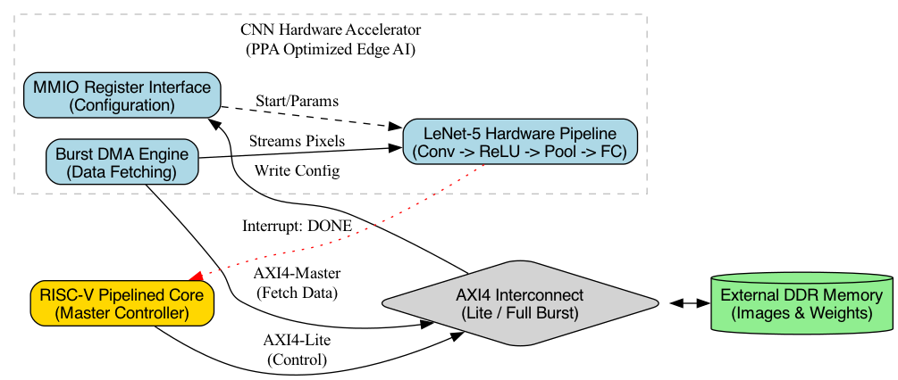
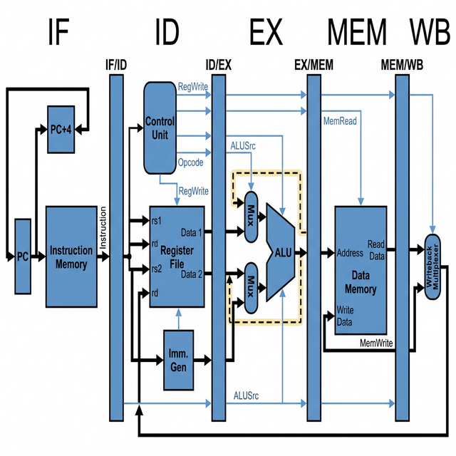

# Architecture Overview

## RISC-V RV32I Processor & Edge AI CNN Accelerator

### System Architecture

The core architecture consists of two deeply integrated yet functionally distinct subsystems: a classic **5-stage pipeline RISC-V RV32I processor** acting as the system controller, and a custom **Edge AI Convolutional Neural Network (CNN) Accelerator** operating as a dedicated, high-performance coprocessor.

Rather than running sequential math operations on the CPU, the RISC-V core offloads image processing/tensor computations to the CNN accelerator using a **Memory-Mapped I/O (MMIO)** bus.



### RISC-V Core

The CPU is a strict 5-stage pipeline design:
| Stage | Name              | Components                          |
|-------|-------------------|-------------------------------------|
| IF    | Instruction Fetch | Program Counter, Instruction Memory |
| ID    | Instruction Decode| Control Unit, Register File, Imm Gen|
| EX    | Execute           | ALU, Forwarding Mux                 |
| MEM   | Memory Access     | MMIO Controller, Data Memory (SRAM) |
| WB    | Write Back        | Writeback Mux (ALU/Mem/MMIO)        |

The CPU supports the base `RV32I` integer instruction set and implements sophisticated hazard handling:
- **Data forwarding** from EX/MEM and MEM/WB stages to EX stage
- **Load-use hazard detection** with pipeline stall (1-cycle bubble)
- **NOP insertion** via IF/ID and ID/EX flush

---

### CNN Accelerator Subsystem

Instead of the processor computing convolutions manually, the accelerator acts as a standalone spatial computer triggered by the CPU. The RISC-V acts as the "Brain", orchestrating a multi-stage convolution pipeline across distinct acceleration units:

```text
┌─────────────────────────┐
│       RISC-V Core       │
│        ("Brain")        │
└───────────┬─────────────┘
            │ MMIO Bus
            ▼
┌─────────────────────────┐
│     CNN Controller      │
│  (Config & Scheduling)  │
└───────────┬─────────────┘
            │ Datapath
      ┌─────┼─────┐
      ▼     ▼     ▼
  ┌──────┐┌──────┐┌──────┐
  │ Conv ││ Conv ││ Conv │
  │ Unit ││ Unit ││ Unit │
  │  1   ││  2   ││  3   │
  └──────┘└──────┘└──────┘
```

#### MMIO Register Map
The processor communicates with the accelerator through standard memory load (`lw`) and store (`sw`) instructions mapped to specific peripheral addresses:
- **`0x8000_0000` (Control):** Write `1` to start the convolution. Read to check if `DONE`.
- **`0x8000_0004` (Config):** Defines image dimensions, kernel size, and channels.
- **`0x8000_0008` (Status):** Polled by the processor to capture interrupts or error states.

#### Hardware Datapath



Once triggered via the MMIO bus, the accelerator processes data independently:

1. **Line Buffers (Sliding Window):** 
   Image pixels stream from block RAM into dual internal line buffers. This physically caches overlapping rows of an image so the accelerator can output a valid `3x3` window of 9 pixels on every single clock cycle.
2. **MAC Array (Multiply-Accumulate):** 
   The spatial computational heart. 9 parallel hardware multipliers compute the dot product of the current 3x3 window against the programmed kernel weights simultaneously.
3. **Channel Accumulation:** 
   For 3D tensors (like RGB images or deep feature maps), the intermediate dot products iteratively accumulate across the depth dimension before applying activation functions (like ReLU).
4. **Writeback:** 
   The resultant mathematical tensor is flushed directly back to the external SRAM block, raising the `DONE` flag to alert the RISC-V core.
