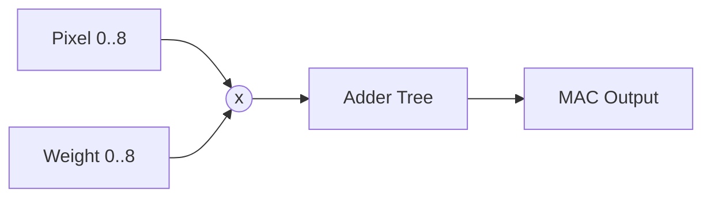

# Module Description

## Basic Datapath

1. **`mac_array.v`**: The core math unit. It implements 9 pipelined multipliers computing `a[i] * w[i]` followed by an adder tree accumulating them into a single product. 
2. **`line_buffer.v`**: Dual configurable length FIFOs maintaining historical row vectors to construct 2D spatial context.
3. **`sliding_window.v`**: Receives 3 column vectors every clock, shifts previous variables right, and exposes a flattened vector of 9 simultaneous spatial variables to the MAC Array.
4. **`channel_accumulator.v`**: Maintains a running tally of intermediate MAC array outputs. It asserts `clear` at the completion of spatial tensor boundaries.

## Control and Wrappers
1. **`conv3d_accelerator.v`**: The wrapper that organizes `line_buffer`, `sliding_window`, `mac_array`, and `channel_accumulator` into an uninterrupted flow of data.
2. **`cnn_controller.v`**: A Moore finite state machine coordinating memory read requests and controlling accelerator module enables.
3. **`cnn_register_interface.v`**: An adaptable MMIO address map defining the memory spaces. Exposes `input_width`, `channels`, etc., to the CNN Controller wrapper.
4. **`riscv_core_controller.v`**: A simulated soft-core driving an instruction sequence simulating software execution. 
5. **`edge_ai_cnn_top.v`**: The primary wrapper connecting the registers to the processor and the registers to the controller.

## Memory Models
- **`feature_map_ram.v`**, **`image_buffer.v`**, **`weight_ram.v`**: Synchronous Dual/Single Port RAM representations, synthesizer friendly for Xilinx block RAMs.
